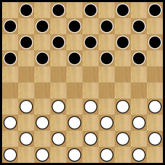
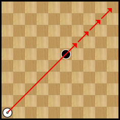

# Jeu de dames

Projet réalisé dans le cadre du cours d'ALG3IR donné à l'ESI.

## Règles de base

### Le matériel

1. Le jeu de dames international se joue sur un damier carré divisé en 100 cases égales, alternativement claires et foncées.
2. Le jeu se joue sur les cases foncées du damier. Il y a donc 50 cases actives. La plus longue diagonale, joignant deux coins du damier et comprenant 10 cases foncées, se dénomme la grande diagonale.
3. Le damier doit être placé de sorte que la première case de gauche, pour chaque joueur, soit une case foncée.
4. Le jeu de dames international se joue avec 20 pions blancs (clairs) et 20 pions noirs (foncés). Avant de débuter une partie, les 20 pions noirs et les 20 pions blancs sont disposés sur les 4 premières rangées de chaque joueur.

  

### La marche des pièces

1. Il existe deux types de pièces : les pions et les dames.
2. Le premier coup est toujours joué par les blancs. Les adversaires jouent un coup chacun à tour de rôle avec leurs pièces.
3. Un pion se déplace obligatoirement vers l’avant, en diagonale, d’une case sur une case libre de la rangée suivante.

  

  Un pion se déplace vers l’avant, en diagonale, sur une case libre de la rangée suivante.

  

3. Lorsqu'il atteint la dernière rangée, le pion devient dame. Pour cela, on couronne le pion en plaçant dessus un deuxième pion de la même couleur.

  

  Lorsqu'il atteint la dernière rangée, le pion devient dame.

  

4. Une dame se déplace en arrière ou en avant sur les cases libres successives de la diagonale qu’elle occupe. Elle peut donc se poser, au-delà de cases libres, sur une case libre éloignée.

  

  Une dame se déplace en arrière ou en avant sur les cases libres de la diagonale qu’elle occupe

  

5. Pour un joueur à qui c'est le tour de jouer, le fait de toucher une de ses pièces jouables implique l’obligation de jouer cette pièce, pour autant que cela soit possible.

### La prise

1. *La prise des pièces adverse est obligatoire et s’effectue aussi bien en avant qu’en arrière.   **Pour plus tard.***

2. Lorsqu’un pion se trouve en présence, diagonalement, d’une pièce adverse derrière laquelle se trouve une case libre, il doit obligatoirement sauter par-dessus cette pièce et occuper la case libre. Cette pièce adverse est alors enlevée du damier. Cette opération complète est la prise par un pion.

  

  Un pion effectue une prise en passant au-dessus d'un pion adverse.
  Il se rend alors sur la case suivante et enlève le pion adverse.

  

3. Lorsqu’une dame se trouve en présence sur la même diagonale, directement ou à distance, d’une pièce adverse derrière laquelle se trouvent une ou plusieurs cases libres, elle doit obligatoirement passer par-dessus cette pièce et occuper, au choix, une des cases libres. Cette pièce est alors enlevée du damier. Cette opération complète est la prise par une dame.

  

  La dame peut effectuer une prise à distance.
  La pièce à prendre doit se situer sur la même diagonale que la dame et il faut également une case vide derrière.
  La dame s'arrête sur la case libre de son choix située après la pièce prise.

  

4. Lorsqu’au cours d’une prise par un pion, celui-ci se trouve à nouveau en présence, diagonalement, d’une pièce adverse derrière laquelle se trouve une case libre, il doit obligatoirement sauter par-dessus cette seconde pièce, voire d’une troisième et ainsi de suite, et occuper la case libre se trouvant derrière la dernière pièce capturée. Les pièces adverses ainsi capturées sont ensuite enlevées du damier dans l’ordre de la prise. Cette opération complète est une rafle par un pion.

  

Le pion prend également vers l'arrière

  

5. Lorsqu’au cours d’une prise par une dame, celle-ci se trouve à nouveau en présence, sur une même diagonale, d’une pièce adverse derrière laquelle se trouve une ou plusieurs cases libres, elle doit obligatoirement sauter par-dessus cette seconde pièce, voire d’une troisième et ainsi de suite, et occuper au choix une case libre se trouvant derrière et sur la même diagonale que la dernière pièce capturée. Les pièces adverses ainsi capturées sont ensuite enlevées du damier dans l’ordre de la prise. Cette opération complète est une rafle par une dame.

  

Au cours d'une prise, la dame change de direction pour prendre d'autres pièces.

  

6. Au cours d’une rafle, il est interdit de passer au-dessus de ses propres pièces.
7. Au cours d’une rafle, il est permis de passer plusieurs fois sur une même case libre mais il est interdit de passer plus d’une fois au-dessus d’une même pièce adverse.

  

  Il est permis de passer plusieurs fois sur une même case libre.
  Mais il est interdit de passer plus d’une fois au-dessus d’une même pièce adverse.

  

8. Une rafle doit être clairement indiquée, pièce par pièce, en posant la pièce preneuse sur la case de saut, le temps d’y passer, et en déposant cette pièce sur la case terminale.

### Le résultat
1. Le gain est obtenu par un joueur lorsque son adversaire :

  * Abandonne la partie
  * Se trouve dans l’impossibilité de jouer alors qu’il a le trait
  * N’a plus de pièces
  * L’égalité, dénommée aussi remise ou nulle, est obtenue pour chacun des adversaires :
  * Lorsqu’aucun des deux ne parvient au gain

## Source

* http://www.ffjd.fr/Web/index.php?page=reglesdujeu
